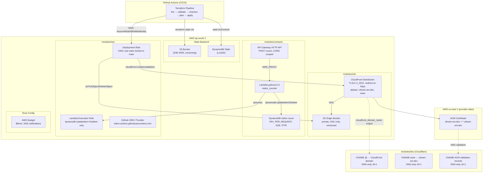
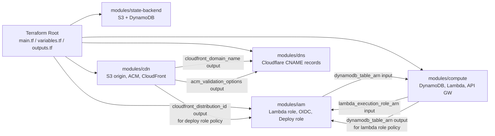

# Design Document: terraform-infra-management

## Overview

This design document describes the Terraform-managed Infrastructure-as-Code (IaC) implementation for the Zero-Trust RaC Platform. The goal is to replace all ClickOps backend provisioning with a fully declarative, version-controlled, and auditable infrastructure lifecycle.

The scope covers:

- Remote state backend (S3 + DynamoDB locking)
- Module structure and repository layout
- All AWS resource layers: S3 origin, CloudFront, ACM, API Gateway, Lambda, DynamoDB, IAM
- Cloudflare DNS management (CNAME flattening, ACM validation records)
- GitHub Actions Terraform CI/CD pipeline with shift-left security scanning
- FinOps budget alarm
- Sensitive value governance

**Primary region:** `ap-south-1`  
**ACM certificate region:** `us-east-1` (CloudFront requirement)  
**Terraform minimum version:** `>= 1.9.0`  
**FinOps hard cap:** $6.00 USD / ₹500 INR per month

---

## Architecture

### System Topology



### Terraform Module Dependency Graph



> Note on circular dependency: The `modules/iam` module consumes both the DynamoDB table ARN (from `modules/compute`) and the CloudFront distribution ARN (from `modules/cdn`). These are resolved by passing outputs from the compute and CDN modules into the IAM module as input variables in the root configuration, which is the standard Terraform pattern for cross-module references.

---

## Components and Interfaces

### Repository Layout

```
zero-trust-rac-platform/
├── terraform/
│   ├── main.tf                  # Root: module compositions, backend config, budget
│   ├── variables.tf             # All root variables with description, type, sensitive
│   ├── outputs.tf               # Root outputs (all sensitive outputs marked sensitive=true)
│   ├── providers.tf             # AWS (ap-south-1), AWS alias (us-east-1), Cloudflare
│   ├── versions.tf              # required_terraform >= 1.9.0, required_providers
│   ├── terraform.tfvars.example # Documented example — never the real .tfvars
│   ├── modules/
│   │   ├── state-backend/
│   │   │   ├── main.tf          # S3 bucket, DynamoDB table, bucket policy
│   │   │   ├── variables.tf
│   │   │   └── outputs.tf
│   │   ├── cdn/
│   │   │   ├── main.tf          # S3 origin, OAC, CloudFront, ACM (us-east-1 alias)
│   │   │   ├── variables.tf
│   │   │   └── outputs.tf
│   │   ├── compute/
│   │   │   ├── main.tf          # DynamoDB table, Lambda, archive_file, API GW, permissions
│   │   │   ├── variables.tf
│   │   │   └── outputs.tf
│   │   ├── dns/
│   │   │   ├── main.tf          # Cloudflare CNAME records (apex, www, ACM validation)
│   │   │   ├── variables.tf
│   │   │   └── outputs.tf
│   │   └── iam/
│   │       ├── main.tf          # Lambda execution role, OIDC provider, deployment role
│   │       ├── variables.tf
│   │       └── outputs.tf
└── .github/
    └── workflows/
        ├── front-end-cicd.yml   # Existing frontend pipeline (unchanged)
        └── terraform-cicd.yml   # New IaC pipeline
```

The Terraform root lives under `terraform/` to keep IaC isolated from the existing frontend tooling (`build.py`, `src/`, `data/`).

### Provider Configuration (`providers.tf`)

```hcl
terraform {
  required_version = ">= 1.9.0"

  required_providers {
    aws = {
      source  = "hashicorp/aws"
      version = "~> 5.0"
    }
    cloudflare = {
      source  = "cloudflare/cloudflare"
      version = "~> 4.0"
    }
    archive = {
      source  = "hashicorp/archive"
      version = "~> 2.0"
    }
  }
}

provider "aws" {
  region = var.aws_region  # ap-south-1
}

# Provider alias required for CloudFront ACM certificates
provider "aws" {
  alias  = "us_east_1"
  region = "us-east-1"
}

provider "cloudflare" {
  api_token = var.cloudflare_api_token  # sensitive = true, sourced from TF_VAR_*
}
```

### Remote Backend Configuration (`main.tf`)

```hcl
terraform {
  backend "s3" {
    bucket         = "zero-trust-rac-tfstate"
    key            = "prod/terraform.tfstate"
    region         = "ap-south-1"
    encrypt        = true
    dynamodb_table = "zero-trust-rac-tfstate-lock"
    kms_key_id     = "alias/terraform-state"
  }
}
```

---

## Data Models

### Module Interfaces (Input Variables and Outputs)

#### `modules/state-backend`

| Variable              | Type     | Required | Sensitive | Description                                            |
| --------------------- | -------- | -------- | --------- | ------------------------------------------------------ |
| `bucket_name`         | `string` | yes      | no        | Globally unique name for the Terraform state S3 bucket |
| `dynamodb_table_name` | `string` | yes      | no        | Name for the DynamoDB lock table                       |
| `kms_key_arn`         | `string` | yes      | no        | ARN of the KMS key for S3 SSE-KMS encryption           |
| `aws_region`          | `string` | yes      | no        | Deployment region (`ap-south-1`)                       |

| Output              | Sensitive | Description                     |
| ------------------- | --------- | ------------------------------- |
| `state_bucket_arn`  | no        | ARN of the S3 state bucket      |
| `state_bucket_name` | no        | Name of the S3 state bucket     |
| `lock_table_name`   | no        | Name of the DynamoDB lock table |

#### `modules/cdn`

| Variable                 | Type           | Required | Sensitive | Description                                                     |
| ------------------------ | -------------- | -------- | --------- | --------------------------------------------------------------- |
| `origin_bucket_name`     | `string`       | yes      | no        | Name for the S3 origin bucket — no default, plan fails if unset |
| `domain_name`            | `string`       | yes      | no        | Primary domain (`vikram-sre.dev`)                               |
| `san_domain`             | `string`       | yes      | no        | SAN wildcard (`*.vikram-sre.dev`)                               |
| `aws_us_east_1_provider` | provider alias | yes      | no        | Provider alias for ACM in `us-east-1`                           |

| Output                        | Sensitive | Description                                               |
| ----------------------------- | --------- | --------------------------------------------------------- |
| `cloudfront_domain_name`      | no        | `*.cloudfront.net` domain — consumed by `modules/dns`     |
| `cloudfront_distribution_id`  | no        | CloudFront distribution ID — consumed by `modules/iam`    |
| `cloudfront_distribution_arn` | no        | CloudFront distribution ARN                               |
| `origin_bucket_arn`           | no        | S3 origin bucket ARN — consumed by `modules/iam`          |
| `acm_validation_options`      | no        | Domain validation options map — consumed by `modules/dns` |
| `acm_certificate_arn`         | no        | Validated ACM certificate ARN                             |

#### `modules/compute`

| Variable                    | Type           | Required | Sensitive | Description                                               |
| --------------------------- | -------------- | -------- | --------- | --------------------------------------------------------- |
| `dynamodb_table_name`       | `string`       | yes      | no        | Physical name of the visitor count table                  |
| `lambda_handler`            | `string`       | yes      | no        | Handler in `<module>.<function>` format                   |
| `lambda_source_dir`         | `string`       | yes      | no        | Path to Lambda source directory for `archive_file`        |
| `lambda_execution_role_arn` | `string`       | yes      | no        | ARN from `modules/iam` output                             |
| `cors_allow_origins`        | `list(string)` | yes      | no        | Allowed CORS origins (e.g., `["https://vikram-sre.dev"]`) |

| Output                   | Sensitive | Description                                                |
| ------------------------ | --------- | ---------------------------------------------------------- |
| `dynamodb_table_arn`     | no        | ARN of the visitor-count table — consumed by `modules/iam` |
| `dynamodb_table_name`    | no        | Name of the visitor-count table                            |
| `api_gateway_invoke_url` | no        | Full `$default` stage invoke URL for frontend config       |
| `lambda_function_arn`    | no        | Lambda function ARN                                        |

#### `modules/dns`

| Variable                 | Type               | Required | Sensitive | Description                                          |
| ------------------------ | ------------------ | -------- | --------- | ---------------------------------------------------- |
| `cloudflare_zone_id`     | `string`           | yes      | no        | Cloudflare zone ID — no default, plan fails if unset |
| `cloudfront_domain_name` | `string`           | yes      | no        | CloudFront domain from `modules/cdn` output          |
| `apex_domain`            | `string`           | yes      | no        | Root domain (`vikram-sre.dev`)                       |
| `acm_validation_options` | `map(object(...))` | yes      | no        | Validation CNAME details from `modules/cdn`          |

| Output          | Sensitive | Description                              |
| --------------- | --------- | ---------------------------------------- |
| `apex_cname_id` | no        | Cloudflare record ID for the root CNAME  |
| `www_cname_id`  | no        | Cloudflare record ID for the `www` CNAME |

#### `modules/iam`

| Variable                      | Type     | Required | Sensitive | Description                                                                           |
| ----------------------------- | -------- | -------- | --------- | ------------------------------------------------------------------------------------- |
| `dynamodb_table_arn`          | `string` | yes      | no        | ARN of the visitor-count table — no default, plan fails if unset                      |
| `s3_origin_bucket_arn`        | `string` | yes      | no        | ARN of the S3 origin bucket                                                           |
| `cloudfront_distribution_arn` | `string` | yes      | no        | ARN of the CloudFront distribution                                                    |
| `state_bucket_arn`            | `string` | yes      | no        | ARN of the Terraform state bucket                                                     |
| `state_lock_table_arn`        | `string` | yes      | no        | ARN of the state lock DynamoDB table                                                  |
| `github_repo`                 | `string` | yes      | no        | `org/repo` string for OIDC sub claim (e.g., `VikramBabariya/zero-trust-rac-platform`) |
| `github_branch`               | `string` | yes      | no        | Branch for OIDC sub claim (e.g., `main`)                                              |

| Output                      | Sensitive | Description                                                   |
| --------------------------- | --------- | ------------------------------------------------------------- |
| `lambda_execution_role_arn` | no        | IAM role ARN for Lambda — consumed by `modules/compute`       |
| `deployment_role_arn`       | no        | IAM role ARN for GitHub Actions OIDC — referenced in workflow |

### Key Resource Configurations

#### State Backend S3 Bucket Policy (Enforcement of SSE-KMS on write)

```json
{
  "Version": "2012-10-17",
  "Statement": [
    {
      "Sid": "DenyNonEncryptedObjectUploads",
      "Effect": "Deny",
      "Principal": "*",
      "Action": "s3:PutObject",
      "Resource": "arn:aws:s3:::BUCKET_NAME/*",
      "Condition": {
        "StringNotEquals": {
          "s3:x-amz-server-side-encryption": "aws:kms"
        }
      }
    }
  ]
}
```

#### S3 Origin Bucket Policy (OAC-only access)

```json
{
  "Version": "2012-10-17",
  "Statement": [
    {
      "Sid": "AllowCloudFrontOACOnly",
      "Effect": "Allow",
      "Principal": { "Service": "cloudfront.amazonaws.com" },
      "Action": "s3:GetObject",
      "Resource": "arn:aws:s3:::ORIGIN_BUCKET_NAME/*",
      "Condition": {
        "StringEquals": {
          "AWS:SourceArn": "CLOUDFRONT_DISTRIBUTION_ARN"
        }
      }
    }
  ]
}
```

#### Lambda Execution Role Inline Policy (Least Privilege)

```json
{
  "Version": "2012-10-17",
  "Statement": [
    {
      "Sid": "DynamoDBVisitorCountAccess",
      "Effect": "Allow",
      "Action": ["dynamodb:UpdateItem", "dynamodb:GetItem"],
      "Resource": "DYNAMODB_TABLE_ARN"
    }
  ]
}
```

#### GitHub Actions Deployment Role Trust Policy

```json
{
  "Version": "2012-10-17",
  "Statement": [
    {
      "Effect": "Allow",
      "Principal": {
        "Federated": "arn:aws:iam::ACCOUNT_ID:oidc-provider/token.actions.githubusercontent.com"
      },
      "Action": "sts:AssumeRoleWithWebIdentity",
      "Condition": {
        "StringEquals": {
          "token.actions.githubusercontent.com:sub": "repo:VikramBabariya/zero-trust-rac-platform:ref:refs/heads/main",
          "token.actions.githubusercontent.com:aud": "sts.amazonaws.com"
        }
      }
    }
  ]
}
```

#### Root `variables.tf` (Sensitive Variables)

```hcl
variable "cloudflare_api_token" {
  description = "Cloudflare API token with DNS edit permissions for vikram-sre.dev"
  type        = string
  sensitive   = true
}

variable "aws_account_id" {
  description = "AWS account ID — used in IAM ARN constructions"
  type        = string
  sensitive   = true
}

variable "notification_email" {
  description = "Email address for AWS Budget SNS alarm notifications"
  type        = string
  sensitive   = true
}

variable "cloudflare_zone_id" {
  description = "Cloudflare zone ID for vikram-sre.dev DNS management"
  type        = string
  sensitive   = false
}
```

---

## Error Handling

### Plan-Time Failures (Required Variables Without Defaults)

These variables have no `default` value. A missing value causes `terraform plan` to exit with an error before any cloud API is called:

| Variable               | Module        | Error if missing                        |
| ---------------------- | ------------- | --------------------------------------- |
| `origin_bucket_name`   | `modules/cdn` | `Error: No value for required variable` |
| `cloudflare_zone_id`   | `modules/dns` | `Error: No value for required variable` |
| `dynamodb_table_arn`   | `modules/iam` | `Error: No value for required variable` |
| `cloudflare_api_token` | root          | `Error: No value for required variable` |
| `notification_email`   | root          | `Error: No value for required variable` |

### Apply-Time Safeguards

- **State locking:** DynamoDB `LockID` prevents concurrent `terraform apply` runs from corrupting state. A failed apply that does not release the lock can be forcibly unlocked with `terraform force-unlock <LOCK_ID>` — this step is documented in the operations runbook.
- **`prevent_destroy` on DynamoDB:** The `visitor-count` table has `lifecycle { prevent_destroy = true }`. Attempting to `terraform destroy` or replace the table raises: `Error: Instance cannot be destroyed`.
- **ACM validation timeout:** `aws_acm_certificate_validation` has `timeouts { create = "45m" }`. If Cloudflare DNS propagation stalls or the API token lacks DNS write permission, apply times out with a clear error after 45 minutes rather than hanging indefinitely.
- **SSE enforcement policy on state bucket:** Any `s3:PutObject` request without the `x-amz-server-side-encryption: aws:kms` header is denied with HTTP 403. This catches any client-side misconfiguration before data reaches S3.
- **CORS enforcement at API Gateway:** Requests with an `Origin` header not matching `https://vikram-sre.dev` receive a `403 Forbidden` response with no CORS headers, preventing cross-origin data leakage.

### Drift Detection

- Lambda `source_code_hash = filebase64sha256(data.archive_file.lambda.output_path)` ensures Terraform detects out-of-band Lambda code changes on the next `plan` run.
- S3 versioning on the state bucket allows rollback to a previous known-good state file if state corruption occurs.

### CI/CD Failure Modes

| Stage                   | Failure Condition               | Pipeline Behaviour                                         |
| ----------------------- | ------------------------------- | ---------------------------------------------------------- |
| `terraform fmt -check`  | Formatting divergence           | Immediate exit, no downstream steps run                    |
| `terraform validate`    | Syntax or provider errors       | Immediate exit                                             |
| `checkov` HIGH/CRITICAL | Security misconfiguration found | Non-zero exit, apply blocked                               |
| `checkov` MEDIUM/LOW    | Low-severity finding            | Warning annotation, pipeline continues                     |
| `terraform plan`        | Invalid resource config         | Exit with error, apply never runs                          |
| `terraform apply`       | AWS API error                   | Apply fails, partial state saved to backend; lock released |

---

## Testing Strategy

This feature is pure Infrastructure-as-Code (Terraform declarative configuration). Property-based testing is **not applicable** — there are no pure functions with input/output behaviour to exercise with randomised inputs. The correct testing strategy for IaC is a layered combination of static analysis, plan-based validation, and policy compliance checks.

> Property-based testing is omitted for this feature because Terraform resources are declarative configurations, not functions. Running any test 100 times yields the same result as running it once. The value is in correctness of declarations, not in input-space coverage.

### Layer 1: Static Analysis (Shift-Left, runs on every PR)

| Tool                   | Purpose                                             | Blocking?                                 |
| ---------------------- | --------------------------------------------------- | ----------------------------------------- |
| `terraform fmt -check` | Enforces canonical HCL formatting                   | Yes                                       |
| `terraform validate`   | Checks syntax, provider schema, variable types      | Yes                                       |
| `checkov >= 3.2`       | CIS benchmark and AWS security best-practice checks | Yes (HIGH/CRITICAL), Warning (MEDIUM/LOW) |

Checkov checks of particular relevance to this codebase:

- `CKV_AWS_18` — S3 access logging enabled
- `CKV_AWS_52` — S3 MFA delete
- `CKV_AWS_86` / `CKV_AWS_68` — CloudFront logging and WAF attachment
- `CKV_AWS_2` — Lambda function using supported runtimes
- `CKV_AWS_116` — Lambda DLQ configured
- `CKV_AWS_50` — Lambda X-Ray tracing enabled

Where a finding is an intentional, documented architectural decision (e.g., no WAF due to FinOps hard cap), it SHALL be suppressed with an inline `# checkov:skip=CKV_ID:Reason` comment, making the waiver auditable in source control.

### Layer 2: Plan Validation (automated in CI, manual for bootstrapping)

`terraform plan -detailed-exitcode` returns exit code 2 when changes are pending and 0 when no-op. The CI pipeline treats both as success (a plan with changes is expected on PRs). Exit code 1 (error) blocks apply.

Plan output is posted as a PR comment (overwriting any previous comment) so reviewers see the exact resource diff before approving.

### Layer 3: Integration Tests (post-apply verification)

After `terraform apply` succeeds in CI, the following AWS CLI checks verify the declared state matches live infrastructure. These run as a post-apply smoke test step in `terraform-cicd.yml`:

| Check                        | Command                                                                   | Validates                    |
| ---------------------------- | ------------------------------------------------------------------------- | ---------------------------- |
| S3 Block Public Access       | `aws s3api get-public-access-block --bucket BUCKET`                       | All 4 flags = `true`         |
| S3 versioning                | `aws s3api get-bucket-versioning --bucket BUCKET`                         | `Status: Enabled`            |
| CloudFront HTTPS enforcement | `curl -sI http://vikram-sre.dev \| grep -i location`                      | `301` redirect to `https://` |
| ACM certificate status       | `aws acm describe-certificate --certificate-arn ARN --region us-east-1`   | `Status: ISSUED`             |
| DynamoDB PITR                | `aws dynamodb describe-continuous-backups --table-name visitor-count`     | `PITR: ENABLED`              |
| Lambda runtime               | `aws lambda get-function-configuration --function-name FUNC`              | `Runtime: python3.12`        |
| OIDC provider thumbprints    | `aws iam get-open-id-connect-provider --open-id-connect-provider-arn ARN` | Both thumbprints present     |

### Layer 4: Policy-as-Code (IAM policy validation)

IAM inline policies and trust policies are validated using `aws iam simulate-principal-policy` in the post-apply step to confirm:

- The Lambda execution role can call `dynamodb:UpdateItem` and `dynamodb:GetItem` on the visitor-count table, and is denied `dynamodb:DeleteTable`.
- The deployment role can call `s3:PutObject` on the origin bucket, and is denied `s3:DeleteBucket`.

### CI Pipeline: `terraform-cicd.yml` Workflow Design

```yaml
name: Terraform IaC Pipeline

on:
  push:
    branches: [main]
    paths: ['terraform/**']
  pull_request:
    branches: [main]
    paths: ['terraform/**']

permissions:
  id-token: write
  contents: read
  pull-requests: write

jobs:
  terraform:
    runs-on: ubuntu-latest
    defaults:
      run:
        working-directory: terraform

    steps:
      - uses: actions/checkout@v4

      - uses: hashicorp/setup-terraform@v3
        with:
          terraform_version: '~> 1.9'

      # Gate 1: Format
      - name: terraform fmt -check
        run: terraform fmt -check -recursive

      # Gate 2: Validate (requires AWS credentials for provider init)
      - name: Configure AWS Credentials (OIDC)
        uses: aws-actions/configure-aws-credentials@v4
        with:
          role-to-assume: ${{ secrets.AWS_DEPLOYMENT_ROLE_ARN }}
          aws-region: ap-south-1
          role-session-name: terraform-${{ github.run_id }}

      - name: terraform init
        run: terraform init -input=false

      - name: terraform validate
        run: terraform validate

      # Gate 3: Checkov Security Scan
      - name: Install checkov
        run: pip install checkov>=3.2

      - name: Run checkov (block on HIGH/CRITICAL)
        run: |
          checkov -d . \
            --framework terraform \
            --soft-fail-on MEDIUM,LOW \
            --compact \
            --output cli \
            --output-file-path console

      # Gate 4: Plan (on PRs, post comment)
      - name: terraform plan
        id: plan
        if: github.event_name == 'pull_request'
        run: terraform plan -no-color -input=false
        env:
          TF_VAR_cloudflare_api_token: ${{ secrets.CLOUDFLARE_API_TOKEN }}
          TF_VAR_aws_account_id: ${{ secrets.AWS_ACCOUNT_ID }}
          TF_VAR_notification_email: ${{ secrets.NOTIFICATION_EMAIL }}

      - name: Post plan comment on PR
        if: github.event_name == 'pull_request'
        uses: actions/github-script@v7
        with:
          script: |
            // Overwrite any previous plan comment on this PR
            const body = `### Terraform Plan\n\`\`\`\n${{ steps.plan.outputs.stdout }}\n\`\`\``;
            const comments = await github.rest.issues.listComments({
              issue_number: context.issue.number, owner: context.repo.owner, repo: context.repo.repo
            });
            const existing = comments.data.find(c => c.body.startsWith('### Terraform Plan'));
            if (existing) {
              await github.rest.issues.updateComment({ comment_id: existing.id,
                owner: context.repo.owner, repo: context.repo.repo, body });
            } else {
              await github.rest.issues.createComment({ issue_number: context.issue.number,
                owner: context.repo.owner, repo: context.repo.repo, body });
            }

      # Gate 5: Apply (on push to main only)
      - name: terraform apply
        if: github.event_name == 'push' && github.ref == 'refs/heads/main'
        run: terraform apply -auto-approve -input=false
        env:
          TF_VAR_cloudflare_api_token: ${{ secrets.CLOUDFLARE_API_TOKEN }}
          TF_VAR_aws_account_id: ${{ secrets.AWS_ACCOUNT_ID }}
          TF_VAR_notification_email: ${{ secrets.NOTIFICATION_EMAIL }}
```

### Secret Injection Pattern

Sensitive variables are never written to disk or step logs. The pattern is:

```
GitHub Secret → TF_VAR_* env var → Terraform sensitive variable → redacted in plan/apply output
```

The `.gitignore` in `terraform/` (and the root `.gitignore`) SHALL include:

```
*.tfvars
*.tfstate
*.tfstate.backup
.terraform/
.terraform.lock.hcl
```

The `.terraform.lock.hcl` is an exception: it **should** be committed for reproducible provider installs. The gitignore entry above is a template; the actual `.gitignore` only excludes `*.tfstate`, `*.tfvars`, and `*.tfstate.backup`.

### Bootstrap Sequence (One-Time Manual Steps)

The state backend cannot manage itself (Terraform cannot store state before the state bucket exists). The bootstrap order is:

1. Create the KMS key, S3 state bucket, and DynamoDB lock table **manually or via a separate bootstrap script** in `ap-south-1`.
2. Run `terraform init` with the `backend "s3"` block pointing to the bootstrapped bucket.
3. Confirm SNS email subscription (one-time manual step after Budget Alarm is applied — documented in `docs/RUNBOOK.md`).
4. All subsequent changes are fully automated through the CI pipeline.

This sequence is documented in `docs/RUNBOOK.md` as a prerequisite section titled "IaC Bootstrap Prerequisites."
