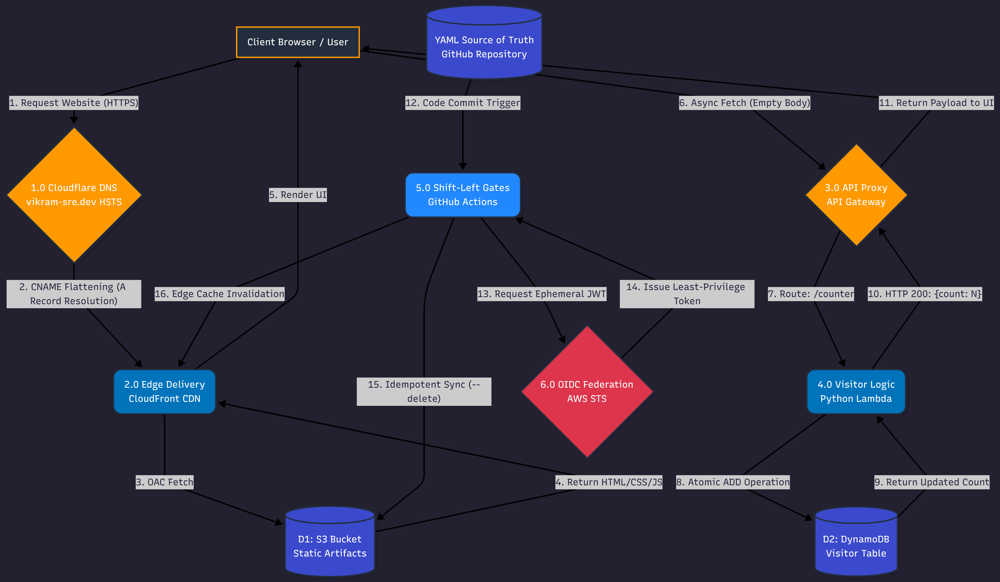

# Level 1 Data Flow Diagram: Serverless Backend & Zero-Trust Delivery

## Context

While the System Architecture diagram outlines the physical cloud infrastructure, this Data Flow Diagram (DFD) maps the logical lifecycle of payloads traversing the system. It explicitly defines the routing logic, data state transformations, deployment pipelines, and **Zero-Trust** security boundaries for both client-side requests and internal CI/CD mutations.

## Diagram

_(Diagram source maintained via Diagrams as Code (Mermaid.js) in `/docs/architecture/source/`)_

## Process Analysis

- **Phase 1: Public Ingress & Static Delivery:** Details the **HSTS**-enforced routing of external client traffic through the `vikram-sre.dev` perimeter to the CloudFront CDN, serving static artifacts from the securely isolated S3 datastore.
- **Phase 2: (Visitor Counter):** Demonstrates the asynchronous API trigger, proxy routing, and the atomic `ADD` operation against the DynamoDB NoSQL data store, ensuring strict concurrency control and data integrity.
- **Phase 3: (Zero-Trust Delivery Pipeline):** Maps the **SRE Maturity Level 3** deployment lifecycle. It visualizes the ingestion of the YAML Source of Truth, the assumption of ephemeral credentials via **OIDC Federation**, the **Idempotent** state synchronization (`--delete`), and the final edge cache invalidation to achieve **Zero-Downtime** releases.
