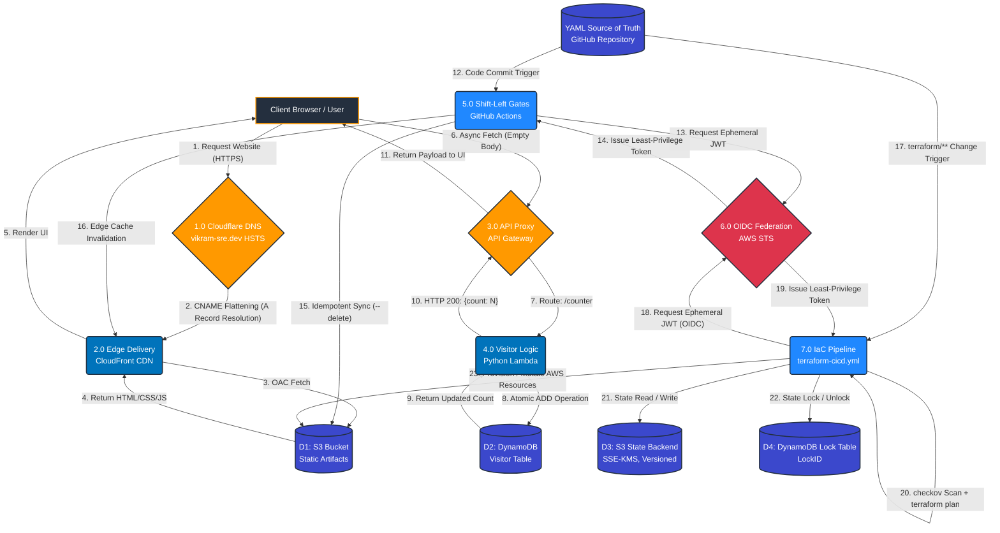

```mermaid
flowchart TD
    %% Custom Styles & Color Taxonomy
    classDef external fill:#242F3E,stroke:#FF9900,stroke-width:2px,color:#FFF;
    classDef process fill:#0073BB,stroke:#232F3E,stroke-width:2px,color:#FFF;
    classDef datastore fill:#3B48CC,stroke:#232F3E,stroke-width:2px,color:#FFF;
    classDef proxy fill:#FF9900,stroke:#232F3E,stroke-width:2px,color:#FFF;
    classDef sec fill:#DD344C,stroke:#232F3E,stroke-width:2px,color:#FFF;
    classDef cicd fill:#2088FF,stroke:#232F3E,stroke-width:2px,color:#FFF;

    %% --- 1. External Entities & Sources ---
    User[Client Browser / User]:::external
    Git[(YAML Source of Truth <br> GitHub Repository)]:::datastore

    %% --- 2. Data Stores ---
    D1[(D1: S3 Bucket <br> Static Artifacts)]:::datastore
    D2[(D2: DynamoDB <br> Visitor Table)]:::datastore
    D3[(D3: S3 State Backend <br> SSE-KMS, Versioned)]:::datastore
    D4[(D4: DynamoDB Lock Table <br> LockID)]:::datastore

    %% --- 3. Processes, Proxies, & Security Gates ---
    P_Ingress{1.0 Cloudflare DNS <br> vikram-sre.dev HSTS}:::proxy
    P_CDN(2.0 Edge Delivery <br> CloudFront CDN):::process
    P_API{3.0 API Proxy <br> API Gateway}:::proxy
    P_Count(4.0 Visitor Logic <br> Python Lambda):::process

    P_CICD(5.0 Shift-Left Gates <br> GitHub Actions):::cicd
    P_STS{6.0 OIDC Federation <br> AWS STS}:::sec
    P_TF(7.0 IaC Pipeline <br> terraform-cicd.yml):::cicd

    %% --- 4. Data Flows ---

    %% Phase 1: HSTS Ingress & UI Delivery
    User -- "1. Request Website (HTTPS)" --> P_Ingress
    P_Ingress -- "2. CNAME Flattening (A Record Resolution)" --> P_CDN
    P_CDN -- "3. OAC Fetch" --> D1
    D1 -- "4. Return HTML/CSS/JS" --> P_CDN
    P_CDN -- "5. Render UI" --> User

    %% Phase 2: Flow A (Visitor Counter)
    User -- "6. Async Fetch (Empty Body)" --> P_API
    P_API -- "7. Route: /counter" --> P_Count
    P_Count -- "8. Atomic ADD Operation" --> D2
    D2 -- "9. Return Updated Count" --> P_Count
    P_Count -- "10. HTTP 200: {count: N}" --> P_API
    P_API -- "11. Return Payload to UI" --> User

    %% Phase 3: Flow B (Zero-Trust CI/CD Delivery)
    Git -- "12. Code Commit Trigger" --> P_CICD
    P_CICD -- "13. Request Ephemeral JWT" --> P_STS
    P_STS -- "14. Issue Least-Privilege Token" --> P_CICD
    P_CICD -- "15. Idempotent Sync (--delete)" --> D1
    P_CICD -- "16. Edge Cache Invalidation" --> P_CDN

    %% Phase 4: Flow C (IaC Delivery Pipeline)
    Git -- "17. terraform/** Change Trigger" --> P_TF
    P_TF -- "18. Request Ephemeral JWT (OIDC)" --> P_STS
    P_STS -- "19. Issue Least-Privilege Token" --> P_TF
    P_TF -- "20. checkov Scan + terraform plan" --> P_TF
    P_TF -- "21. State Read / Write" --> D3
    P_TF -- "22. State Lock / Unlock" --> D4
    P_TF -- "23. Provision / Mutate AWS Resources" --> D1
```
