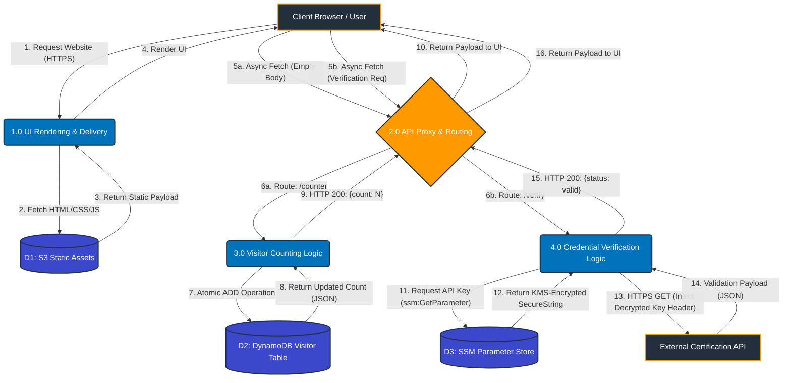

```mermaid
flowchart TD
    %% Custom Styles & Color Taxonomy
    classDef external fill:#242F3E,stroke:#FF9900,stroke-width:2px,color:#FFF;
    classDef process fill:#0073BB,stroke:#232F3E,stroke-width:2px,color:#FFF;
    classDef datastore fill:#3B48CC,stroke:#232F3E,stroke-width:2px,color:#FFF;
    classDef proxy fill:#FF9900,stroke:#232F3E,stroke-width:2px,color:#FFF;

    %% --- 1. External Entities ---
    User[Client Browser / User]:::external
    ExtAPI[External Certification API]:::external

    %% --- 2. Data Stores ---
    D1[(D1: S3 Static Assets)]:::datastore
    D2[(D2: DynamoDB Visitor Table)]:::datastore
    D3[(D3: SSM Parameter Store)]:::datastore

    %% --- 3. Processes ---
    P1(1.0 UI Rendering & Delivery):::process
    P2{2.0 API Proxy & Routing}:::proxy
    P3(3.0 Visitor Counting Logic):::process
    P4(4.0 Credential Verification Logic):::process

    %% --- 4. Data Flows ---

    %% Phase 1: Static UI Delivery
    User -- "1. Request Website (HTTPS)" --> P1
    P1 -- "2. Fetch HTML/CSS/JS" --> D1
    D1 -- "3. Return Static Payload" --> P1
    P1 -- "4. Render UI" --> User

    %% Phase 2: Flow A (Visitor Counter)
    User -- "5a. Async Fetch (Empty Body)" --> P2
    P2 -- "6a. Route: /counter" --> P3
    P3 -- "7. Atomic ADD Operation" --> D2
    D2 -- "8. Return Updated Count (JSON)" --> P3
    P3 -- "9. HTTP 200: {count: N}" --> P2
    P2 -- "10. Return Payload to UI" --> User

    %% Phase 3: Flow B (Dynamic Credential Validator)
    User -- "5b. Async Fetch (Verification Req)" --> P2
    P2 -- "6b. Route: /verify" --> P4

    %% Security Sub-Process
    P4 -- "11. Request API Key (ssm:GetParameter)" --> D3
    D3 -- "12. Return KMS-Encrypted SecureString" --> P4

    %% The "Decryption in Memory" happens inside P4

    %% External Outbound
    P4 -- "13. HTTPS GET (Inject Decrypted Key Header)" --> ExtAPI
    ExtAPI -- "14. Validation Payload (JSON)" --> P4
    P4 -- "15. HTTP 200: {status: valid}" --> P2
    P2 -- "16. Return Payload to UI" --> User
```
