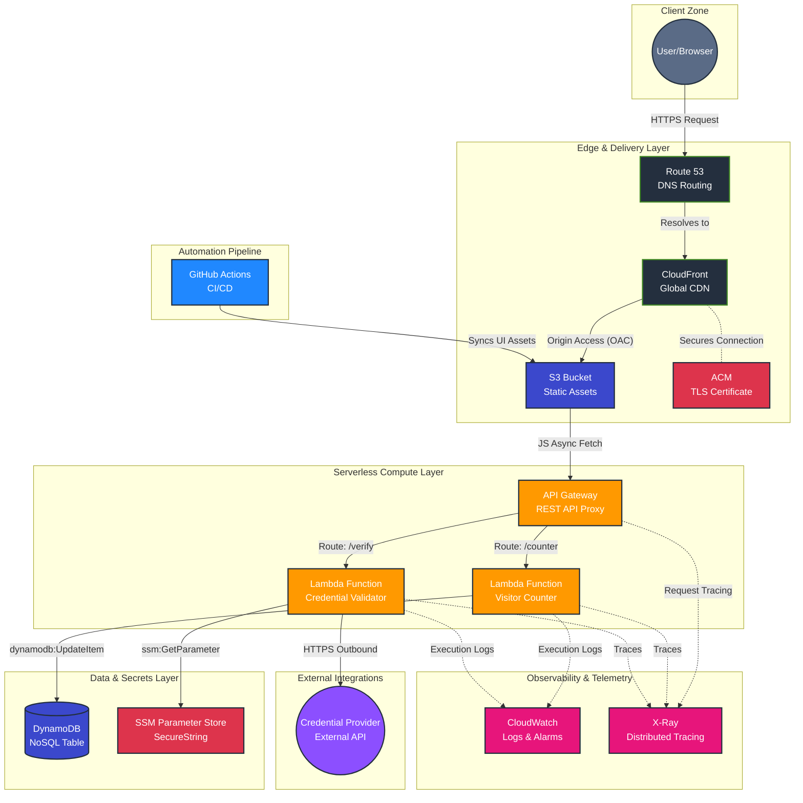

```mermaid
graph TD
%% Styles & Color Taxonomy
classDef client fill:#5A6B86,stroke:#232F3E,stroke-width:2px,color:#FFF;
classDef edge fill:#242F3E,stroke:#3F8624,stroke-width:2px,color:#FFF;
classDef compute fill:#FF9900,stroke:#232F3E,stroke-width:2px,color:#FFF;
classDef db fill:#3B48CC,stroke:#232F3E,stroke-width:2px,color:#FFF;
classDef sec fill:#DD344C,stroke:#232F3E,stroke-width:2px,color:#FFF;
classDef ext fill:#8C4FFF,stroke:#232F3E,stroke-width:2px,color:#FFF;
classDef obs fill:#E7157B,stroke:#232F3E,stroke-width:2px,color:#FFF;
classDef cicd fill:#2088FF,stroke:#232F3E,stroke-width:2px,color:#FFF;

    %% --- Architectural Tiers ---

    subgraph Tier1_Client ["Client Zone"]
        User((User/Browser)):::client
    end

    subgraph Tier2_Delivery ["Edge & Delivery Layer"]
        R53[Route 53 <br> DNS Routing]:::edge
        CF[CloudFront <br> Global CDN]:::edge
        S3[S3 Bucket <br> Static Assets]:::db
        ACM[ACM <br> TLS Certificate]:::sec
    end

    subgraph Tier3_Backend ["Serverless Compute Layer"]
        APIG[API Gateway <br> REST API Proxy]:::compute
        LambdaCount[Lambda Function <br> Visitor Counter]:::compute
        LambdaValid[Lambda Function <br> Credential Validator]:::compute
    end

    subgraph Tier4_Data ["Data & Secrets Layer"]
        DDB[(DynamoDB <br> NoSQL Table)]:::db
        SSM[SSM Parameter Store <br> SecureString]:::sec
    end

    subgraph Tier5_External ["External Integrations"]
        ExtAPI((Credential Provider <br> External API)):::ext
    end

    subgraph Layer_Observability ["Observability & Telemetry"]
        CW[CloudWatch <br> Logs & Alarms]:::obs
        XRay[X-Ray <br> Distributed Tracing]:::obs
    end

    subgraph Layer_CICD ["Automation Pipeline"]
        GH[GitHub Actions <br> CI/CD]:::cicd
    end

    %% --- Data Flow & Networking ---

    %% Public Internet
    User -- HTTPS Request --> R53
    R53 -- Resolves to --> CF
    CF -. Secures Connection .- ACM
    CF -- Origin Access (OAC) --> S3

    %% Frontend API Calls
    S3 -- JS Async Fetch --> APIG

    %% Microservice A: Counter
    APIG -- Route: /counter --> LambdaCount
    LambdaCount -- dynamodb:UpdateItem --> DDB

    %% Microservice B: Validator
    APIG -- Route: /verify --> LambdaValid
    LambdaValid -- ssm:GetParameter --> SSM
    LambdaValid -- HTTPS Outbound --> ExtAPI

    %% Telemetry Mapping
    APIG -. Request Tracing .-> XRay
    LambdaCount -. Execution Logs .-> CW
    LambdaCount -. Traces .-> XRay
    LambdaValid -. Execution Logs .-> CW
    LambdaValid -. Traces .-> XRay

    %% Deployment Mapping
    GH -- Syncs UI Assets --> S3
```
