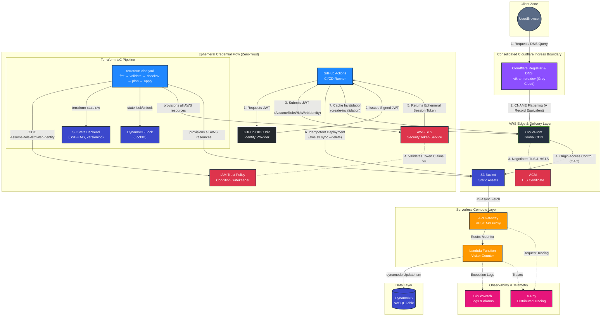

# System Architecture: Zero-Trust RaC Platform

This document serves as the Single Source of Truth (SSoT) for the network topology, data flow, and security boundaries of the Zero-Trust Resume-as-Code (RaC) Platform.

### Edge-Network & Public Ingress Boundary

**Strategic Ingress Definition:** The public entry point for this platform is strictly governed by the `vikram-sre.dev` namespace. This boundary acts as the primary **Shift-Left Quality Gate** for human evaluation, optimizing **MTTE**. To enforce strict **FinOps** cost boundaries and reduce architectural complexity, authoritative name resolution is entirely consolidated within Cloudflare's global Anycast network, completely bypassing AWS Route 53.

> **Architectural Decision Record:** For the definitive technical justification regarding this single-provider consolidation, the choice of a **DNS Only (Grey Cloud)** configuration, and the native **HSTS** edge mechanics, refer to:
> [ADR 0008: Strategic Domain Name Ingress and Registrar Procurement Selection](../../adr/0008-domain-and-registrar-selection.md)

---

### Architecture Topology

> **Pipeline separation note:** `GHRunner` (frontend pipeline, `front-end-cicd.yml`) and `TF_Pipeline` (IaC pipeline, `terraform-cicd.yml`) are separate GitHub Actions workflow files. Both authenticate via the same OIDC trust relationship with AWS, but use different `role-session-name` values (`github-actions-<run_id>` vs `terraform-<run_id>`) to distinguish sessions in CloudTrail and IAM condition evaluation.
